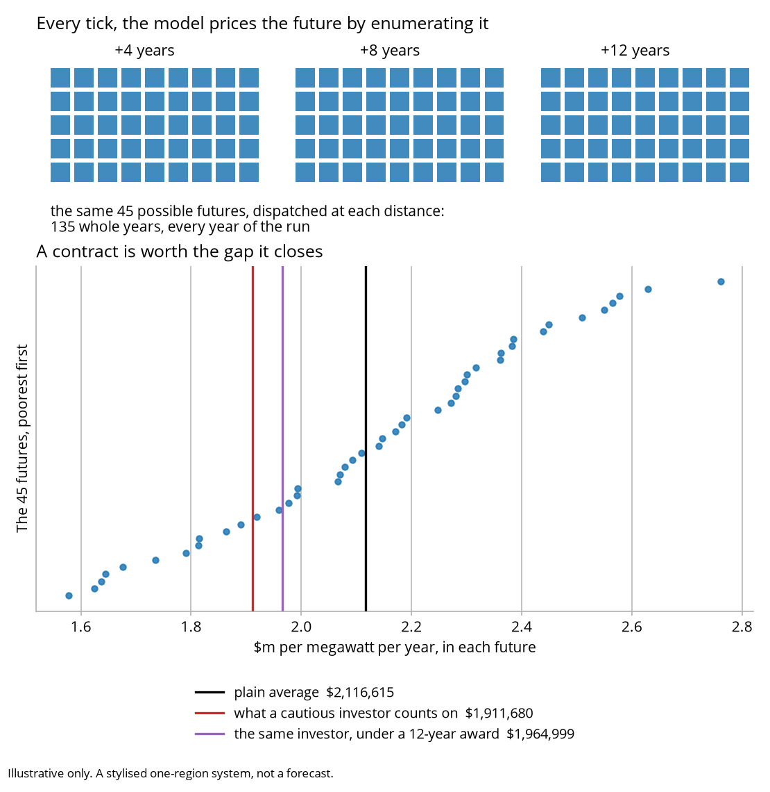
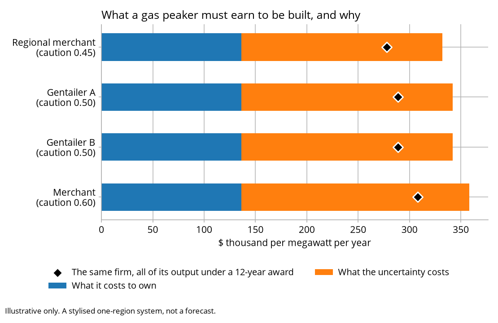

# How it fits together

The map: what each piece does, what it hands to the next one, and where to start
reading.

This page is written for somebody about to read the code.
[GLOSSARY.md](GLOSSARY.md) explains what the model does and what its words mean, and
assumes no background.

The code uses **anchor** for two unrelated things: the reference price a contract
lane clears at, and each of the distances ahead the forward view is priced at, which
are 4, 8 and 12 years. The glossary calls the second one **projection years**.

## Start here

Read in this order and each piece only needs the one before it.

1. `core/dispatch.py`: one year, hour by hour. Everything else consumes its output.
2. `core/contracts.py`: what a swap and a cap are, and how they settle.
3. `core/forward.py`: what investors think the next 4, 8 and 12 years look like.
4. `core/investment.py`: the four lines that decide whether anything gets built.
5. `core/simulate.py`: the loop that runs those four, 20 times.

The rest is either an input to those (`config.py`, `core/weather.py`), a market they
transact in (`core/clearing.py`, `core/agents.py`), a mechanism switched on top
(`core/esem.py`, `core/scheme.py`), or a way of looking at the result (`core/report.py`,
`plots.py`, `cli.py`).

## What each piece does

| Piece | What it is |
|---|---|
| `config.py` | The settings and the packaged tables. Strict: an unknown key raises rather than leaving a default in place |
| `core/weather.py` | Five synthetic shape-years from one seed, always 8,760 hours |
| `core/dispatch.py` | The merit order, the scarcity ladder, administered pricing, hydro against its budget, and storage shaving quantities |
| `core/windows.py` | Finds the worst contiguous run of days, rather than being told where it is |
| `core/report.py` | Blocks, quarters, duration curves, per-unit revenue, the calibration check |
| `core/contracts.py` | Swaps and caps, settled over the full hourly series and never a sample |
| `core/agents.py` | Six archetypes; what separates them is risk aversion and exposure, not size |
| `core/clearing.py` | What each contract lane clears at, what it costs a peaker to stand ready, the one measure of caution the whole model shares, and the market where retailers and producers trade |
| `core/crossing.py` | The option where buyers and sellers have to find a price between them instead of both accepting the reference price |
| `core/forward.py` | 45 possible futures, priced at four, eight and 12 years out; what each technology would earn in each; and how much plant investors assume everybody else builds |
| `core/investment.py` | How much of a project is still exposed to the spot price, what it therefore has to earn to be built, how fast the fleet may change, and when a plant closes |
| `core/esem.py` | The reliability scheme: how much to buy, what it is worth, when it is committed, who pays |
| `core/scheme.py` | A state scheme: a milestone a year, a ceiling, a budget, and why it was missed. Note the units: it buys NAMEPLATE megawatts where the reliability lane buys DELIVERED FIRM ones, and the two are not addable |
| `core/simulate.py` | The tick loop, and the order the eight steps run in |
| `plots.py`, `cli.py` | The dashboard, the worst-week and price-duration charts, and three commands |
| `tools/` | The probes behind every measured claim in the documents, and the charts in them |

## What a year looks like

1. Plant decided years ago and finished this year enters service.
2. The year is dispatched and priced.
3. Contracts written earlier settle against that price.
4. The book ages: what has finished delivering leaves it.
5. The forward view is rebuilt, and the guess at what everybody else builds is revised once.
6. The administrator offers its position back, then the bilateral market covers the rest.
7. The scheme's auction runs, awarding at final investment decision.
8. Exit notices are given, and then entry is decided.

`core/simulate.py` says which of those orderings carry weight, and why.

## The forward view, which is where the work goes

`core/forward.py` is where most of the computing goes. Every tick it enumerates 45
possible
futures, five weather patterns by three growth paths by three
peak severities, and dispatches each of them in full at 4, 8 and 12 years ahead. That
is 135 whole dispatched years behind every investment decision, and 2,700 over a
20-year run, which is why it is the expensive call in a tick and why the sequential
investment rule costs about twice the run time.

<picture>
  <source media="(prefers-color-scheme: dark)" srcset="outputs/canonical/forward_view_dark.png">
  
</picture>

Enumerating rather than sampling has three consequences. The same settings always
give the same picture, so no seed enters here. The result is a distribution rather
than a point, which is what lets the investment rule work on the spread. The odds are
fixed at the start and never revised, so nobody in this model learns which future they
are in, which is deliberate and costs something: see
[KNOWN_LIMITATIONS.md](KNOWN_LIMITATIONS.md).

The investor's own tolerance for that spread then decides most of what it demands.

<picture>
  <source media="(prefers-color-scheme: dark)" srcset="outputs/canonical/hesitancy_dark.png">
  
</picture>

## Three things the model holds to

Everything is per megawatt-year. Rent and fixed cost are on the same basis, so no
capacity-factor assumption enters the build decision. A peaker running two per cent of
the year and a wind farm running 35 per cent are each tested against their own
costs.
It is also what lets the forward view leave the entry it assumes open to technology
rather than naming one in advance: a test that divided a fixed cost by a duty cycle
would have to know the duty cycle first, and so would end up pinned to whichever
technology somebody had measured.

Risk is priced once. One function decides how cautious a firm is, and both the cap
lane and the investment rule go through it. A firm that priced the same tail one way
when writing insurance and another when building the plant that covers it could
arbitrage the difference between them.

Nothing forecasts. Contract prices are weighted averages of prices that have
already happened, and the forward view is a list of possible futures at fixed odds.
That is the whole mechanism behind boom and bust: scarcity lifts prices, investors
extrapolate, everybody builds, and the plant arrives together into a market that no
longer needs it.

## What it does not do

[KNOWN_LIMITATIONS.md](KNOWN_LIMITATIONS.md) lists what the model gets wrong, with
the measurement behind each entry.
