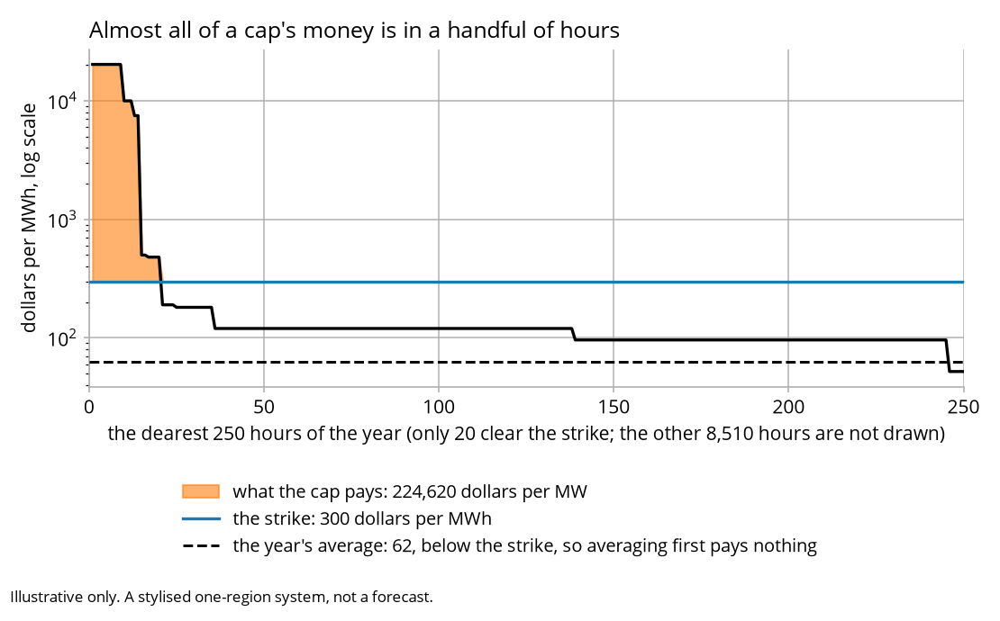
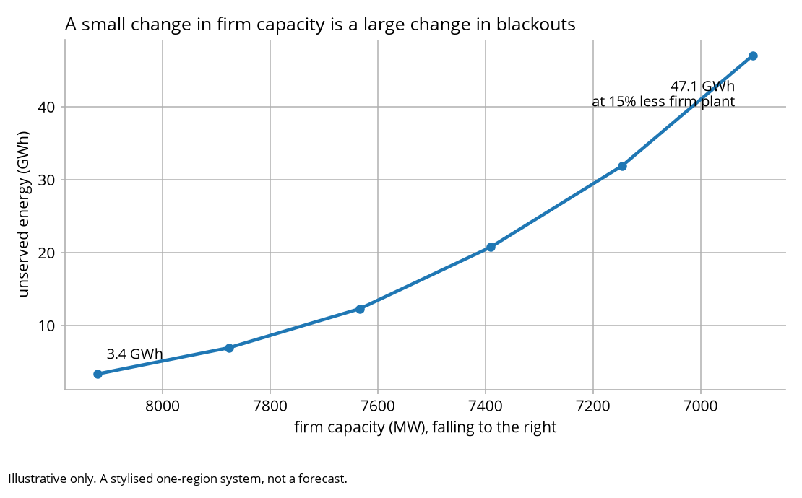

# What this model gets wrong

Each entry is labelled with one of five kinds. A defect that is still there and a
simplification made on purpose call for very different reactions.

If a word here is unfamiliar, [GLOSSARY.md](GLOSSARY.md) defines it in plain
language.

| | what it is | how to read it |
|---|---|---|
| [Storage is scheduled on quantities](#storage-is-scheduled-on-quantities-not-on-the-price-it-produces) | guarantee | four properties that follow from the rule's shape |
| [A cap is a tail instrument](#a-cap-contract-here-is-almost-purely-a-tail-instrument) | result | expect lumpy payouts across weather years |
| [Decisions cannot see each other](#decisions-taken-against-a-shared-forecast-do-not-see-each-other) | **defect** | it sets how much gets built |
| [The lane's screen does not bind](#the-lanes-sanity-screen-does-not-bind) | simplification | a guard against nonsense, sitting clear of real bids |
| [Cover is shared out by capacity](#cover-is-shared-out-by-capacity-and-settled-on-energy) | simplification | exposure carries the leg difference, not portfolio shape |
| [Exit cannot see a contract](#exit-cannot-see-a-contract-and-entry-can) | **defect** | latent here, because the rule below never fires |
| [Economic exit never fires](#the-economic-exit-rule-never-fires-on-this-fleet) | result | every retirement here is the one written in fleet.csv |
| [Nobody pays for the state scheme](#nobody-pays-for-the-state-scheme) | **defect** | its contracts settle real money that no cost line carries |
| [Demand response is free](#demand-response-costs-nothing-and-somebody-is-paying) | **defect** | it sets prices, supplies energy, and costs no line anything |
| [Small in megawatts, huge in blackouts](#why-a-modest-gap-in-building-is-a-huge-gap-in-blackouts) | result | why capacity adequacy is argued about at all |
| [What the bracket does to the scheme](#what-the-bracket-does-to-the-schemes-result) | bracket | the reliability direction travels; the cost verdict does not |
| [A lower hurdle moves the mix](#a-lower-hurdle-changes-what-gets-built-not-only-how-much) | result | firm capacity does not follow the hurdle |
| [The guess at what others build never settles](#investors-guess-at-what-everyone-else-builds-never-settles) | simplification | read it as a signal, not as a settled answer |
| [Investors never learn their future](#investors-never-learn-which-future-they-are-in) | simplification | nobody here forecasts, and it costs something |
| [The scheme buys plant built anyway](#the-scheme-can-buy-plant-that-would-have-been-built-anyway) | result | additionality, made visible rather than hidden |
| [Part of the effect is reallocation](#part-of-the-schemes-effect-is-reallocation-not-addition) | result | what the awards displace matters as much as what they add |
| [A scheme cannot fix an early year](#a-scheme-cannot-fix-a-year-that-arrives-before-its-plant-does) | result | the most misread rows in a paired run |
| [The levy can be a rebate](#the-levy-can-run-either-way) | result | the administrator holds a position and prices move |
| [The administrator has no view](#the-administrator-never-has-a-view) | simplification | it never withholds, reads the market or trades |
| [Negotiating starts from one number](#when-buyers-and-sellers-negotiate-both-start-from-the-same-number) | bracket | the direction is real; the size is a setting |
| [A capacity target is not reliability](#a-capacity-target-buys-capacity-and-the-model-will-not-let-it-buy-reliability) | result | the easiest thing here to misread |
| [Which future the market was in](#the-schemes-worth-depends-on-which-future-the-market-turned-out-to-be-in) | bracket | no single run is a property of the scheme |
| [What the simplification costs](#what-the-simplification-costs-elsewhere) | simplification | one region, synthetic weather, a stylised fleet |
| [What is deliberately exact](#what-is-deliberately-exact) | guarantee | the properties the conclusions actually rest on |

Five kinds, and the label is the first thing to read:

- **defect** means the model gets this wrong.
- **simplification** means it was left out on purpose, and says what that costs.
- **result** means it is not a limitation at all. These are here because readers
  reliably mistake them for faults.
- **bracket** means the model can show a range and cannot say where in it the truth
  sits. Quoting either end as the answer is the mistake.
- **guarantee** means something the model holds exactly, and that its conclusions
  rest on.

## Storage is scheduled on quantities, not on the price it produces

A store fills the trough up to a level and shaves the peak down to a level, with the
levels set so the energy balances across the round trip. Four properties follow from
the shape of that rule rather than from any tuning.

A store cannot make the peak worse. Charging fills to a level at or below the
discharge level, so the post-storage residual never exceeds the pre-storage peak.
Adding four-hour storage to this fleet lowers peak net load monotonically, from
9,300 MW through 8,320 and 7,340 to a floor of 7,074 MW, where the day is flat enough
that more storage changes nothing.

A store cannot charge and discharge in the same hour. The two levels are ordered, so
the hours they select are disjoint.

A store cannot deliver energy it never stored. The state of charge is tracked hour by
hour through the day, and an hour that asks for more than the store holds is capped at
what it holds. Checking the day's totals instead would let a store whose trough falls
after its peak deliver in the evening energy it does not store until that night.

The schedule does not chase the price it produces. Quantities are a function of the
residual and the unit. Price decides only whether a day's spread covers the round
trip, and each unit judges that against the residual the units before it have left.
Measured by doubling every thermal running cost with hydro removed, so the residual
storage sees cannot move, the schedule changes in 49 hours of 8,760 and by up to
490 MW. That is the spread gate turning whole days on and off, which is what it is
for, rather than quantities being read off the price.

Because the residual does not depend on the price, there is no fixed point to chase
and dispatch runs in one pass.

What it costs. The fleet's import capability is set at 1,000 MW, which is the lever
that decides how tight the system is. The four mild shape-years sit between a fifth
and four fifths of the reliability standard and the lull-on-heat year at 2.3 times it.

What is still approximate. A store spreads its discharge across the hours above its
threshold rather than concentrating power in the single tightest hour. In the load
shedding hours of the drought shape-year the fleet's stores deliver most of their
rated power, so what remains of this is small. An optimiser would still do better by
moving energy out of a merely expensive hour and into a shedding one.

## A cap contract here is almost purely a tail instrument

The ladder's two cheapest tiers are 1.0 MW at $300/MWh and 20.8 MW at $500/MWh,
transcribed as increments from the published demand-side participation table. They are
so small against a 12 GW system that any hour reaching them is short by far more, so
both are exhausted inside the same hour and the price lands on the tier above. Neither
ever sets a price.

The fleet originally stopped at gas peakers around $190/MWh, which left no hour able
to settle anywhere between $190 and $7,500: the price duration curve had a hole
exactly where a $300 cap contract lives. A stylised high-cost peaking tier, 500 MW at
$480/MWh, now fills it, and hours do settle in the band.

What that did not change is the cap's character. A $300 cap pays $107,368 per MW-year
averaged across the five shape-years, and 99 per cent of it comes from the 35 hours at
or above $7,500. Only 56 hours in the whole set reach the strike at all. That is not a
defect. A cap is insurance against extremes, and its value in the real market is
likewise concentrated in a handful of intervals. A reader should expect
the payout to be lumpy across weather years rather than smooth: the five shape-years
pay $50,080, $74,760, $87,080, $100,300 and $224,620, a spread of more than four to
one between the mildest and the worst.

<picture>
  <source media="(prefers-color-scheme: dark)" srcset="outputs/canonical/cap_payout_dark.png">
  
</picture>

The shaded area is the payout in the worst of the five years. Averaging that year's
prices before asking how much sat above the strike gives zero, because the average is
below $300.

## Decisions taken against a shared forecast do not see each other

This model has three places where several decisions are taken in the same year
against one forecast, and none of them sees the others. They are the same failure
in three costumes, and they are grouped here because each was found
separately and none of them looks like the others until it is.

Entry, in the forward view: every candidate technology answers "would I be
worth building?" about a market none of the others has entered. Letting all seven
move in one pass gave 15 gigawatts of assumed entry on a 12 gigawatt
system. Fixed by moving one marginal entrant a tick.

Exit: every plant's going-forward position is evaluated against a fleet in
which none of the others has left. Fixed by capping notices per year and firing
them worst-first, so the forward reprices between cohorts.

Investment: every producer prices every candidate as though it were the only
thing being added to a market that contains none of the others. That is the right assumption for one small entrant and the wrong one for 12
decisions taken in the same year against the same forward view, which is what a
tick here contains: four producers considering three candidates each, none of them
seeing the others.

This third one is not fixed, and it is the most consequential of the three. What
stops it running away is the annual build ceiling, which is a pacing choice rather
than an economic force.

Measured on the canonical seed, over 20 years, almost every megawatt of merchant
build is placed at the ceiling: 48,800 of 53,000 MW, and 29 of the 34 technology-years
in which anything was built. That is 92 per cent. Doubling the ceiling does not
relieve it: the market builds more, 69,700 MW, and still at the cap, 97 per cent. The
scheme leg behaves the same way, 98 per cent at the tight ceiling and 100 at the loose
one.

The reason is the failure named above, and the loose version of it is wrong: price
feedback does exist. Measured on this fleet, adding 600 MW of wind to the forecast
takes about $65,000 per MW-year off what the next block of wind is worth and adds
about $11,000 to the hurdle it has to clear (`tools/marginal_feedback.py`):

| wind already added | hurdle | what it is worth | clears it? | among the few it picks? |
|---|---|---|---|---|
| none | $355,577 | $1,123,000 | yes | no |
| 600 MW | $364,121 | $1,055,669 | yes | no |
| 1,200 MW | $392,086 | $978,417 | yes | no |
| 1,800 MW | $407,370 | $905,134 | yes | no |
| 2,400 MW | $413,231 | $851,305 | yes | no |
| 3,000 MW | $412,633 | $797,660 | yes | no |

The discipline is real and far too weak to bind inside one year: the gap opens at
$767,000 and closes at roughly $76,000 a block, so shutting wind off would take about
6,000 MW while the annual ceiling stops at 1,200, and the ceiling always bites first.

The last column matters. Wind clears its own hurdle three times
over at every step and is never among the handful of candidates a producer actually
takes to a decision, because others rank above it on surplus. Clearing a hurdle and
being chosen are different questions here, and only the second one builds anything.

What fills the ceiling is not one investor wanting an unlimited amount. Each
producer wants exactly one 600 MW block, so it is four producers picking the same
winner against a ceiling that allows two: the first two get their block and the other
two are shut out. The economics therefore decides which technologies get built and
whether a year builds at all. It never decides how much.

The annual build volume in this model is a parameter, not a result, and it is not
a parameter that only bites when the forward is enthusiastic - it binds in every year
anything is built. Read every quantity that depends on the pace of build with that
in front of it, including the reliability comparison, whose ceiling sensitivity is
measured further down.

The fix is the one the other two costumes already got: decide sequentially and
reprice in between, so the second block is offered a market that contains the first.
It is built and it is runnable both ways: `run(investment="sequential")` from Python,
and `--scenario repriced_investment` from the command line. It is not the default,
and the measurement below says why.

| | build | at the ceiling | firm at the end | unserved |
|---|---|---|---|---|
| simultaneous (default) | 63,900 MW | 96.9% | 11,430 MW | 78.3 GWh |
| sequential | 68,900 MW | 46.6% | 11,170 MW | 122.4 GWh |

*(Run over nine possible futures rather than the full 45, so these are not
comparable with the headline figures; the two rows are comparable with each other.)*

The repair reaches what it was aimed at: the share of build sitting on the ceiling
falls from essentially all of it to under a half, so the economics starts deciding
how much, and it is still not an improvement. Unserved energy rises by more than
half.

Not for the reason it first appears, and the reason is the interesting part.
The repriced rule does not build less. It builds 68,900 MW against 63,900, which is
eight per cent more. What it builds is a different mix: more storage and more solar,
less open-cycle gas, so it ends with 11,170 MW of firm capacity against 11,430, which
is 2.3 per cent less. Offering each producer a market that already contains the last
one's plant makes the next block of firm capacity look less necessary, and the money
goes to energy instead.

The two rules are not "builds a lot" and "builds too little". They are two
different answers to what to build, and the one that sees more clearly picks a mix
that is cheaper per megawatt and worse at the peak. Real investors observe each other
slowly and partially, and the truth sits between the two rows above.

The honest reading is that this model brackets the annual build volume rather
than determining it, and both bounds are runnable (`--scenario repriced_investment`
from the command line). That is a better thing to know than either number alone, and
it is more informative than either. What it is not is a defect with a fix waiting to
be applied.

Two things the repair still does not do. It reprices between producers and not
between the candidates of one producer, which is why nearly half of build still lands
on the ceiling. It also costs about twice the run time, because rebuilding the forward
is the expensive call in a tick.

### Why a modest gap in building is a huge gap in blackouts

The two rules differ by very little where it counts. Over 20 years the repriced
rule ends with 11,170 MW of firm capacity against 11,430, which is 2.3 per cent less,
and unserved energy rises by 56 per cent.

That ratio is a property of reliability rather than a quirk of the repair, and it
can be measured on its own with no investment rule involved at all: scale the
dispatchable fleet down and dispatch the same weather year
(`tools/reliability_convexity.py`).

| firm capacity | change | unserved | times the base |
|---|---|---|---|
| 8,121 MW | - | 3.36 GWh | 1.0x |
| 7,877 MW | -3% | 6.94 GWh | 2.1x |
| 7,633 MW | -6% | 12.30 GWh | 3.7x |
| 7,390 MW | -9% | 20.76 GWh | 6.2x |
| 7,227 MW | -11% | 27.41 GWh | 8.2x |
| 6,903 MW | -15% | 47.51 GWh | 14.2x |

<picture>
  <source media="(prefers-color-scheme: dark)" srcset="outputs/canonical/reliability_curve_dark.png">
  
</picture>

*(Firm capacity here is the dispatch's own figure. A second sum over the fleet gives
about 3,000 MW more, because hydro is scheduled against its annual budget and netted
out of the residual, so adding its nameplate back counts it twice. Both numbers were
in these documents under the same name.)*

Take three per cent of the firm plant away and the lights go out twice as often;
take 15 and it is 14 times as often. The 2.3 per cent the repriced rule
costs sits just below the first row here, which predicts a little under twice the
unserved energy, and the full run shows 1.56 times. The chain closes: a wedge of
about $79,000 per block moves the mix rather than the amount, which shaves 2.3 per
cent off firm capacity, which multiplies blackouts by half again.

Nothing is broken here. Reliability lives in the worst few hours of a year, and the
load in those hours is steep, so each megawatt removed exposes many more hours than
the one before it. It is also the reason capacity adequacy is argued about at all: a
disagreement about whether a market builds slightly too much or slightly too little
is a disagreement about whether the lights stay on.

### What the bracket does to the scheme's result

Both legs always use the same rule, so each comparison is internally consistent. The
comparison is not the same at the two ends, and a reader has to be told which part of
it travels. Run at both ends on a reduced lattice, so these figures are not comparable
with the 10-seed table above (`tools/bracket_check.py`):

| rule | merchant | with the scheme | unserved moves | resource cost | awarded |
|---|---|---|---|---|---|
| simultaneous (default) | 67.4 GWh | 16.3 GWh | -51.1 GWh | scheme costs $7.60bn | 19,600 MW |
| sequential | 357.6 GWh | 83.5 GWh | -274.1 GWh | scheme costs $0.10bn | 22,950 MW |

The reliability direction survives and is the robust half. The scheme reduces unserved
energy at both ends, by a factor of four at one and more than four at the other.

The size of the effect does not survive, and neither does the cost verdict's
magnitude. At the pessimistic end the merchant market leaves five times as much outage
on the table, so the same scheme has far more to avoid, and what it costs in net
resource terms falls from $7.60bn to almost nothing. The sign of the cost holds at
both ends here, which it did not at earlier settings, but the range is wide enough
that no single figure should be quoted as the scheme's cost.

The verdict on a procurement scheme in this model turns on how badly you think a
merchant market under-builds, which is a quantity the model brackets rather than
determines. That is close to the actual policy argument.

The ceiling is shared, so whoever is asked first gets it. Producers are taken in an
order that rotates with the year, which stops the same firm capturing it every time.
Rotating is not an answer to who should win; it stops the order of a tuple being one.

## The lane's sanity screen does not bind

The auction screens bids against a ceiling before clearing them. settings.toml
describes it as a guard against nonsense rather than a price cap, and it has never
rejected anything on this fleet, which is what a guard against nonsense should do.

The two settings are in dollars per megawatt hour and a bid is per megawatt year, so
the ceiling is converted over the year's hours, which is the basis a bid covers.

The dearest bid the model can construct is a plant earning nothing at all in the pool:

| technology | long-run cost per MW-year, earning nothing |
|---|---|
| eight-hour battery | $306,517 |
| wind | $282,143 |
| combined cycle gas | $203,621 |
| four-hour battery | $178,529 |
| solar | $142,163 |
| open cycle gas | $136,135 |
| two-hour battery | $107,718 |

A real bid is net of what the plant expects to earn and so lower again, well clear of
the $500/MWh floor the ceiling starts from.

Where it would bind is a design question and has not been touched. Making the ceiling
tight enough to reject an expensive but honest bid would change which bids clear, and
choosing that level is a decision rather than a measurement.

## Cover is shared out by capacity and settled on energy

This is a simplification rather than an oversight. The design's own scope rule is
that exposure, and not the shape of a producer's portfolio, carries the difference
between the two legs. Splitting cover by expected energy instead of by capacity would
be modelling the portfolio, which is one of the things left out on purpose. What
follows is what that costs, so a reader knows the size of it.

When retailers buy swaps, the volume is split across producers in proportion to the
capacity each has available. What a swap settles on is energy. Those are not the same split, and on the
packaged fleet they are a long way apart:

| producer | what it owns | share of capacity | share of energy |
|---|---|---|---|
| gentailer_a | coal, gas, wind | 42.1% | 68.0% |
| gentailer_b | coal, solar | 29.6% | 24.0% |
| regional_merchant | hydro and batteries | 16.6% | 8.8% |
| merchant | peakers and pumped hydro | 11.6% | -0.8% |

The peaker owner is the clearest case. Its plant runs a couple of per cent of the
year and its pumped hydro consumes more than it returns, so across a whole year it is
a net consumer of energy. The allocation still hands it 11.6 per cent of every
megawatt of fixed-price cover the market writes.

The evidence is then clipped away. `achieved_swap_cover` divides cover by
expected output and caps the answer at one, so a producer sold forward well beyond
anything it can generate reports as fully hedged rather than as impossible. Its
exposure goes to the floor, its hurdle drops, and nothing anywhere says why.

Weighting the split by expected energy rather than by capacity is the obvious repair.
It is not applied here, because it changes which producers carry which risk and so
what every one of them builds, and that is a design decision rather than a
measurement.

## Exit cannot see a contract, and entry can

Entry reads the contract book. `residual_exposure` takes the swap cover a producer
has already written and the award it may hold, and lowers the hurdle accordingly.

Exit reads nothing. `going_forward_npv_per_mw` is handed the plant, the forward view,
the settings and the year, and no book at all. A plant whose price is fixed for
12 years by a scheme award is tested for retirement against the spot prices that
award exists to insulate it from, and can be retired on a run of years in which its
actual revenue never moved.

The asymmetry is the point. The same model says a contract makes a project worth
building and then forgets the contract when asking whether to keep it open. Netting
the plant's in-force settlement into the going-forward test is the repair, and it is
not applied here because it changes the retirement schedule, which changes everything
downstream of it.

On the packaged fleet this is latent rather than active, because the exit rule
never fires at all: see [the section below](#the-economic-exit-rule-never-fires-on-this-fleet).
It is written down because it is a property of the rule and not of the fleet, so it
becomes live the moment anybody changes the cost table, brings a retirement forward,
or runs a scenario in which plant does start losing money.

## The economic exit rule never fires on this fleet

Measured over a 20-year canonical run and a 10-year one: not a single exit
notice is issued. Every retirement in this model is the date written in
`fleet.csv`, or the one a scenario forces.

Two separate things stop it, and they cover the whole fleet between them.

Nothing is ever close to unviable. The worst going-forward position any plant
reaches over 10 years:

| plant | worst going-forward value, $/MW | in |
|---|---|---|
| open cycle gas | +$482,426 | 2034 |
| the high-cost peaking tier | +$585,069 | 2034 |
| combined cycle gas | +$895,485 | 2034 |
| the youngest coal | +$1,134,086 | 2034 |

A notice needs two consecutive negative years. Nothing here is negative even once,
and the nearest miss is nearly half a million dollars per megawatt clear.

A plant close to retiring cannot be measured at all. The test values a plant
by looking it up in each projection year. A plant that has already retired by the
nearest projection is absent from all of them, the lookup finds nothing, and the
function returns zero with the comment "not measurable: never a reason to exit". The
nearest projection is four years out, so any plant within four years of its
scheduled retirement is structurally invisible to the exit rule, which is when a
real one would be deciding whether to go early. Two of the coal stations sit
in that blind spot for the whole period they are eligible.

None of this is broken. A fleet in which nothing is losing money is a legitimate
answer, and forced retirement is how a boom-and-bust run is meant to be driven
anyway. It has three consequences:

- the careful staggering repair described further up this file, capping notices per
  year and firing them worst-first, is real code that this fleet never executes;
- the tick order's "exit, then entry" does no work here, because there are no notices
  for entry to see; and
- if you change the fleet or the cost table, check this again before believing any
  claim about retirement, because the rule is closer to dormant than to tuned.

## Nobody pays for the state scheme

The state capacity target writes real contracts. A generator sells, a counterparty
holds, and money settles between them every year of the contract's life, exactly as
it does for a reliability-scheme award.

The difference is that nothing charges it to anyone. The levy is computed only from
the reliability administrator's position and only on the scheme leg, and the state
target runs on the merchant leg against a different counterparty. Measured over 10
years with the target switched on: five contracts written, levy $0.00/MWh in every
year, administrator net $0, reported scheme cost $0.

Excluding a contract settlement from the resource cost is right, because it is a
transfer and moves no real resources. Excluding it from the bill is not. The whole
discipline this model teaches is to read the two cost lines together, and here is an
instrument whose cost appears in neither, so a reader comparing a capacity target
with a reliability lane on what they cost cannot do it.

The megawatts and the milestone are reported and are the point of the contrast; the
money is not. Who should pay for a state scheme is a policy question with more than
one defensible answer - consumers through a levy, as the reliability lane assumes,
or taxpayers, or retailers - so nothing here has been made to charge it.

## Demand response costs nothing, and somebody is paying

The scarcity ladder is real machinery. Four tiers of customers agree to stop drawing
power at rising prices, from 1 MW at $300/MWh to 364 MW at $10,000, and when a tier
is called it sets the price for that hour. It supplies energy in the model's own
balance identity, on the same footing as a generator.

It is paid nothing. `ladder_mw` reaches no cashflow, no cost line and no chart
anywhere in the model. Measured over 10 years on the canonical seed, the ladder
supplies energy the market values at $0.253bn on the merchant leg and $0.174bn on
the scheme leg, and neither figure appears in anybody's accounts.

Two things follow.

The resource cost is missing a real cost. A customer who agrees to go without
electricity gives something up, and the tier price is this model's own estimate of
what: that is what the number in `dsr.csv` means. Leaving it out makes shedding load
through the ladder free, when it is merely cheaper than the alternative.

Consumers are not charged for it. The wholesale line is the price times the energy
actually delivered, rather than the whole of operational demand, which would include
the megawatt hours the ladder shed. What remains is that nobody is paid for shedding:
paying the ladder means deciding who pays and at what price, which is a design
question rather than an arithmetic one.

Read the ladder, for now, as a price-setting mechanism rather than as a participant
with a balance sheet.

## Investors' guess at what everyone else builds never settles

When an investor here works out what a project would earn, it has to assume something
about how much plant everybody else will build, because a crowded market pays less.
The model works that assumption out by trial: assume some entry, see which technologies
would still be worth building, assume a bit more of those, and repeat until nothing is
worth building any more. That last state is the answer, and reaching it takes many
passes.

A run does not take many passes. It takes one a year, and the actual fleet changes
underneath it every year, so what the investment rule reads is a half-finished
calculation chasing a target that has already moved.

Measured against a frozen fleet, with the risk loading off, over 40 passes, the
near projection settles and the far one does not:

| pass | four years | eight years | 12 years |
|---|---|---|---|
| 1 | 1,936 MW | 3,805 MW | 5,102 MW |
| 20 | 7,048 MW | 15,850 MW | 17,983 MW |
| 30 | 7,048 MW | 17,555 MW | 23,201 MW |
| 40 | 7,048 MW | 18,020 MW | 25,609 MW |

The four-year projection is unmoved from pass 20, and the eight-year from about
pass 35. The 12-year one never arrives: it is still climbing between
the 30-ninth pass and the fortieth, and nothing here says where it would stop. A
20-year run gives each projection 20 steps in total, and the fleet it is
chasing moves at every one of them, so a run sees far less convergence than even this.

The projection is also not held to the annual build ceiling that holds the market, so
in principle it can assume plant that could not physically arrive in time. On the
packaged fleet the near one does not: the ceiling allows 8,200 MW a year across all
seven technologies and the four-year projection assumes 7,048 MW. That is a thinner
margin than it looks, and the far projections are far above it. Re-check this
whenever the ceiling or the cost table moves.

Read the belief as a signal and not as an equilibrium. It is enough to make the
market respond to scarcity with the right sign and the right rough size, which is
what the comparison needs. It is not a statement about where free entry would land,
and the megawatt figures above should not be quoted as one.

## Investors never learn which future they are in

The forward view keeps the same odds on its three demand growth paths that it
started with, a third each, whatever the path the world has actually taken has been
doing for 15 years. That is
deliberate: the forward stays an honest distribution and
nobody in this model forecasts - but it means a run on the high growth path is one
where investors are persistently building for a slower world than the one they are
in, and the reliability outcome carries that.

It is tempting to reach for this to explain why the scheme costs more on some draws
than others. It does not: that was tested and the answer is below, under what the
scheme's worth depends on. Telling the forward view which path the world is on makes
the scheme cheaper on a slow one and dearer on a fast one, so it moves the problem
rather than removing it.

## The scheme can buy plant that would have been built anyway

A bid is what a plant still needs after the certainty equivalent of what it expects
to earn in the pool. Where that comes out at zero the plant needed nothing, and the
lane awards it anyway, at a strike equal to the expected price and a cost of nothing.
The lane closes, the reliability standard is met on paper, and the scheme has bought
something the market was going to deliver on its own.

This is the additionality problem, and it is real rather than a defect to fix. What
this model does is make it visible: a zero-priced award is exactly the signature of
it, and it shows up on the first tick of a run where the near anchor is short enough
to make everything look profitable. It should be read as a finding rather than as
capacity the scheme delivered.

## Part of the scheme's effect is reallocation, not addition

The auction runs before the investment step, which
matters physically: one supply chain builds both. An award consumes annual build
room that the merchant rule would otherwise have used, and the scheme leg builds
noticeably less unsubsidised plant than the merchant leg does. Counted off the
fleet at the end of 20 years on the canonical seed, rather than inferred:

| | merchant | with the scheme |
|---|---|---|
| unsubsidised build | 53,000 MW | 36,850 MW |
| awarded | nil | 17,550 MW |
| new plant in total | 53,000 MW | 54,400 MW |
| the same plant as firm MW | 21,930 MW | 20,837 MW |
| unserved energy | 414.1 GWh | 39.5 GWh |

So 16,150 MW of unsubsidised build makes way for 17,550 MW of awards, the scheme leg
ends with 1,400 MW more plant, and on the firm-factor table it ends with 1,093 MW
less firm capacity than the merchant leg while shedding a tenth as much energy.

That last pair says the static firm-capacity measure does not predict the reliability
outcome here. What the scheme buys is not more firm
megawatts on the table. What it buys is plant contracted to stand behind a scarcity
hour, arriving in the years the shortfall falls in. The measure and the outcome part
company, and the outcome is the one the model dispatches.

Read as a limitation, that means the annual build rate is a pacing choice rather than
an economic force, and it is doing real work in the comparison - measurably so, and
in both directions: see the ceiling table in the section on which future the market
turned out to be in. Read as a result, it is the more interesting half: on this seed
a fleet barely larger in megawatts, and smaller on the firm-capacity table, shed a
tenth as much energy, which is a statement about what capacity is for.

## A scheme cannot fix a year that arrives before its plant does

This is the most easily misread result in a paired run. The
scheme leg is not better than the merchant leg in the first two or three years of a
run, because the plant it awarded in year one has not been built yet. On the packaged
fleet the worst year of the whole horizon, at 19 times the reliability
standard, is identical on both legs. That is the lead time, and it is the reason a
procurement scheme is an instrument about the future rather than a response to the
present.

## The levy can run either way

The administrator buys a hedge from each awarded plant and sells it on to retailers.
It buys at the price the auction struck, which is the forward view's expectation for
the plant's delivery years plus the uplift that carries the bid. It sells at the
market price for each delivery, because nobody buys a hedge above the market.

Two things follow. What it never recovers is the uplift, which is the bid, and that
is the scheme's cost. It also holds the position for as long as nobody has bought it,
which is a long spot position struck on a projection. When prices come in above that
projection the administrator is in pocket and the levy is a rebate; when they come in
below, consumers pay.

The levy is therefore not a fee. Over a 20-year run it changes sign, and reading any
one year's figure as the price of the scheme's capacity will mislead in both
directions.
The cost of the capacity is the bids, which `compare` reports separately.

## A lower hurdle changes what gets built, not only how much

A contract, a longer underwrite or a lower risk premium all lower the bar a project
must clear. None of them reliably raises firm capacity, because a lower bar changes
which technology clears it first, and the technologies differ by a factor of 17 in
how much firm capacity a megawatt of nameplate carries.

Measured three ways, all pointing the same way. A 10-year underwrite reduces firm
capacity on three of four weather seeds, by up to 795 MW, while unserved energy falls
or holds on all four: the cheaper bar buys storage and solar in place of gas, and the
fleet delivers more from less firm plant. The repricing investment rule builds more
in total and ends with less firm capacity. A state capacity target leaves firm
capacity unchanged to the megawatt and still moves unserved energy, through what its
awards displace.

Read a capacity number and a reliability number as two separate answers. In this
model the first does not determine the second.

## The administrator never has a view

It recycles at the lane anchor and warehouses whatever nobody buys. It does not
withhold volume to hold a price up, does not read the market, and does not trade on
its own account. The conduct lever offers a fire sale as the alternative, which is
the other end of the same absence of judgement. A real administrator would sit
somewhere between, and where it sat would be worth money.

## When buyers and sellers negotiate, both start from the same number

The extension that makes the two sides of the contract market find each other,
rather than both accepting an anchor, builds each curve by stepping away from that
same anchor in equal slices. That makes them mirror images, and mirror images have a
property to know before reading anything into a run made this way: the price
comes back at the anchor whatever the curves are shaped like, and the volume is
decided by how finely they are cut rather than by how steep they are.

The elasticity lever does work where the two sides value the block differently, which
is what elasticity should mean. It does nothing where they agree. Giving the two
sides genuinely different valuations would need a model of what each of them thinks
the block is worth, which is a bigger thing than this extension is.

What the extension does show is real in direction and parametric in size. Assuming
both sides accept the anchor buys more cover than making them find each other, and
that flows straight into every producer's exposure and so into every hurdle. How
much more is set by how many slices each curve is cut into, and by whether that
number is odd. Three slices trade two thirds, five trade three fifths, and any even
number trades exactly one half: with an odd count one slice sits on the anchor and
crosses with its mirror, and with an even count none does. The two fifths quoted
elsewhere is five slices, and five is a setting rather than a finding. A magnitude
that turns on the parity of a parameter is not a magnitude to quote at a room.

## A capacity target buys capacity, and the model will not let it buy reliability

This is a result rather than a limitation, and it is here because it is the easiest
thing in the model to misread.

The reliability lane buys delivered firm megawatts, sized on the projected shortfall,
and the reliability outcome moves. The state scheme buys nameplate megawatts against
a number in a policy. On the packaged fleet it adds 2,350 MW of wind and solar,
displaces 1,600 MW of merchant wind through the shared annual build ceiling, spends
about five million dollars, and changes unserved energy by nothing at all.

That is what firm factors of a tenth and a twentieth mean, and a model that could not
show it would be one in which any megawatt was as good as any other. The two
instruments are not comparable in the units they are written in, and adding their
megawatts together is the mistake this arrangement exists to make impossible.

Two things follow. The scheme's milestone is missed on this
fleet, and the reason is named: nobody could build it that fast. Most of what it
buys costs nothing, because wind already clears its own hurdle here, so the scheme is
paying for plant the market was building anyway. Both are findings rather than
defects, and both would be invisible in a model that reported only megawatts
procured.

## The scheme's worth depends on which future the market turned out to be in

Ten seeds, 20 years each, both legs on each seed's own shared weather. The scheme
improves reliability on every one of the 10. It lowers the total resource cost on one.

Splitting each seed's resource-cost difference into the outage the scheme avoided and
everything else, since unserved energy priced at the value of lost load is one of the
four terms and subtracting it leaves fuel, fixed costs and capital together:

| | across 10 seeds |
|---|---|
| outage avoided | +$0.05bn to +$7.60bn, positive on all 10 |
| fuel, fixed and capital | -$0.96bn to -$6.68bn, negative on all 10 |

Neither line changes sign. The scheme always avoids outage and always spends more on
plant and fuel to do it, and which of the two is larger decides the total. On nine of
the 10 seeds the second is larger, so the total goes against the scheme; on the tenth
the outage avoided is an order of magnitude above anything else in the set and the
total goes with it.

That makes the trade explicit rather than ambiguous. What the scheme buys is
reliability, at a price in real resources, and whether the price is worth paying turns
on the value of lost load, which is a regulatory figure here and not a measurement.

The sort is the finding, and it is monotone in growth. Taken by the demand growth path
each run drew:

| path | seeds | outage avoided | awarded |
|---|---|---|---|
| low | 3 | +$0.05bn to +$0.78bn | 4,650 to 6,350 MW |
| central | 5 | +$0.72bn to +$1.03bn | 8,750 to 15,100 MW |
| high | 2 | +$0.61bn to +$7.60bn | 10,750 to 17,550 MW |

On a slow-growing system the scheme buys capacity that has almost nothing to do: it
still keeps some lights on, and it costs billions. On a fast-growing one it can avoid
an outage bill large enough to cover everything it spent. The megawatts it buys rise
with the growth path, so it responds to the future it is in, and it responds to a
future it only half knows.

How much of the reliability gain is the pacing parameter? The auction runs before the
investment step, so an award consumes build room the merchant rule would otherwise
have used. Run the same comparison at twice the annual ceiling and watch the
difference between the legs, which is what `tools/ceiling_sensitivity.py` does. It
takes the four seeds where the scheme helped least, plus the one where it helped most
as a control:

| seed | esem - merchant at ceiling 2 | at ceiling 4 |
|---|---|---|
| 111 | -2.5 GWh | 0.0 GWh |
| 20260101 | -12.1 GWh | 0.0 GWh |
| 31415926 | -30.1 GWh | +2.0 GWh |
| 19990101 | -35.4 GWh | +0.4 GWh |
| 20260904 (control, scheme helped most) | -374.5 GWh | +0.7 GWh |

Doubling the ceiling removes the whole of the scheme's advantage on all five seeds,
including the control, where 374.5 GWh becomes 0.7 the other way. The merchant leg
gains far more from the extra room than the scheme leg does, which is what to expect
if a large part of what the scheme provides is permission to build sooner.

The reliability comparison is therefore substantially a statement about a pacing
parameter, and four is no more correct than two: the finding is the sensitivity, not a
better value. A reader who takes one number from this file should take that one,
because it bounds every reliability claim above it.

What the extra room does not do is relieve the ceiling itself. At either value almost
every megawatt is still built at the cap: 92 per cent of merchant build and 98 per
cent of the scheme leg's at a ceiling of two, and 97 and 100 per cent at four. Raising
the limit raises what gets built and leaves the limit binding, which is the section on
decisions that cannot see each other, measured from the other side.

### Would it help if the scheme knew which future it was in?

The tempting explanation for the scheme costing more on slow-growing draws is that
the lane is sized from a forward view that keeps the same odds on all three growth
paths whatever the world has been doing, so a scheme that cannot learn which future it
is in keeps buying for the average of them.

That can be tested without a design change. Put all the odds on the path each run
actually drew, so the forward view knows what the run knows, and hold the realised
weather and the realised path identical, which `tools/knowing_the_path.py` asserts
rather than assumes. Run over nine possible futures rather than 45, so these
figures are not comparable with
the 10-seed table above:

| | across 10 seeds |
|---|---|
| buys less | 8 |
| resource cost improves | 7 |
| outage avoided improves | 2 |
| both improve | 1 |
| neither improves | 2 |

The negative result holds. Knowing the path makes the scheme buy less on 8 of the
10 seeds, which is what the story predicts. It does not follow through: the cost line
improves on 7, the outage line on 2, and both together on only 1.

Two seeds show why the intuition is unreliable. On the canonical seed the scheme buys
2,850 MW less and the cost improves from -$7.60bn to -$3.26bn, which looks like
the story working, except that the outage it avoids goes from +$1.04bn to
-$3.06bn: it bought less and got less. On 19990101 it buys 4,850 MW less and
everything improves at once, which is the story working exactly as told. The same
change does opposite things on two draws from the same model.

Whatever makes the scheme expensive on a slow path, not knowing which path it is on
is not it. The question is closed, and the explanation it closes is an easy one to
reach for.

## What the simplification costs elsewhere

One region, so nothing locational: no interconnectors, no transmission build, no
regional price divergence. Synthetic weather, so the probability of the drought year
is stipulated at one in five rather than measured. A stylised fleet of about 15
rows, so no unit-level commitment, no minimum stable levels and no outage draws. The
reliability standard is held flat across the whole horizon rather than stepped.

## What is deliberately exact

The energy balance closes to the floating-point limit in every hour of every
packaged run: generation net of curtailment, plus the demand-response ladder, plus
unserved energy, equals operational demand.

With one boundary, and it is reachable from the command line. Rooftop solar is a
fixed 5,200 MW that is netted off demand and never curtailed, because it sits behind
the meter and does not bid. Take the system peak far enough below its packaged 12,500
MW and there are hours when rooftop alone exceeds demand by more than the utility wind
and solar fleet can be cut back to absorb. The surplus then has nowhere to go and is
silently dropped:

| `--peak` | worst hourly imbalance | hours | energy unaccounted for |
|---|---|---|---|
| 12,500 (packaged) | 0 | 0 | 0 |
| 10,000 | 0 | 0 | 0 |
| 9,000 | 0 | 0 | 0 |
| 8,900 | 14.3 MW | 2 | 16 MWh |
| 8,500 | 255.6 MW | 8 | 1,055 MWh |
| 8,000 | 469.5 MW | 28 | 5,263 MWh |
| 7,000 | 1,082.8 MW | 369 | 77,066 MWh |

Nothing warns you. `esem-sandbox run --peak 7000` reports every shape-year inside the
reliability standard with no unserved energy at all, while discarding 77 GWh that
should have shown up somewhere. The guarantee above holds for the packaged system and
for anything near it; it does not hold for a system small enough that its own rooftop
overwhelms it, and the model does not currently say so at the point of use. Hydro delivers its stated annual budget exactly. No unit
generates at a price below its own offer. These are tested, and they are the
properties the model's conclusions actually rest on.
