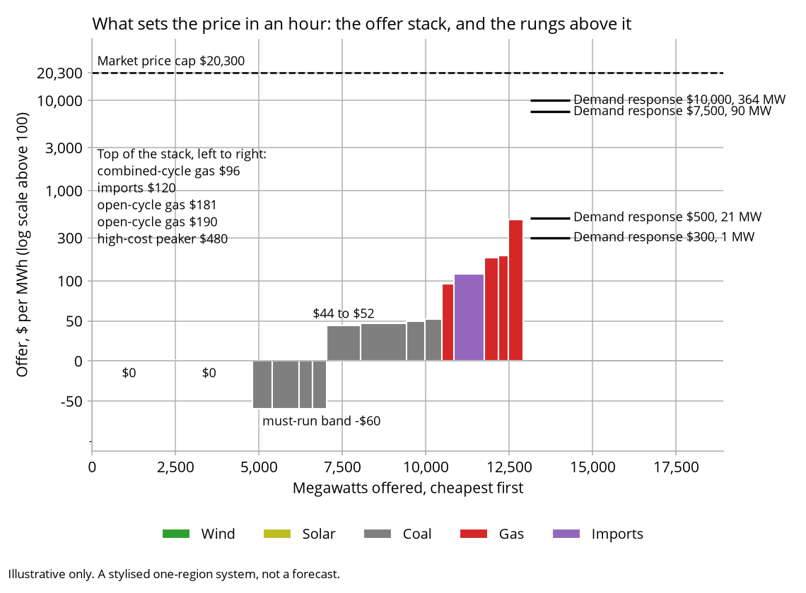

# ESEM sandbox

An agent-based model of one electricity market region, in which firms that dislike risk decide what to build. It is small enough to execute and analyse results in a very short period. It runs on numpy and matplotlib.

## What this model is for

A least-cost model asks what an electricity system should contain. It minimises the cost of meeting demand and a reliability standard, and whatever plant is cheapest is built, because something is assumed to build it.

This model asks who would build it. Each firm faces an income it cannot predict, values that income below its average because it is uncertain, and commits to an investment only when what it expects to earn covers what the plant costs to own. No one is obliged to build anything, so the answer is what a market delivers rather than what a central planner would order.

The distance between those two answers is what about electricity policy is really about. A gas peaker in this model costs about $136,000 per megawatt-year to own, and the firms want $331,000 to $357,000 before building one. About three-fifths of the bar is caution rather than cost, and a least-cost model cannot see that gap because no one in it is cautious.

That is also why a contract can cause plant to be built. A 12-year contract on all of a plant's output removes uncertainty rather than paying for it, and the bar falls by about a sixth; the three-year swaps that retailers buy on their own account move it by a few per cent. The same money handed over as a subsidy would do less.

<picture>
  <source media="(prefers-color-scheme: dark)" srcset="outputs/canonical/hesitancy_dark.png">
  
</picture>

This is a simplified, open version of a larger research model that needs a solver licence for efficiency and is not yet public. It reproduces how that model prices scarcity, settles contracts and decides what to build, and excludes details that add realism but are not essential. The small version exists so the chain of reasoning can be read and explored, and so that it runs in minutes.

## The mechanism it is built around

The Electricity Services Entry Mechanism (ESEM) is a proposed reform to Australia's National Electricity Market. A central body would run auctions and sign long-dated contracts with new generators, on the argument that private contract markets do not offer terms long enough to finance the plant the system needs. It is intended to replace the Capacity Investment Scheme. Policy considerations around the ESEM are about whether it helps, what it costs and who ends up paying.

The model runs 20 annual steps of one region, hour by hour. The scheme can be switched on, and the same 20 years run again beside it on the same weather.

[](https://colab.research.google.com/github/MarkusMannheim/esem_sandbox/blob/main/notebooks/walkthrough.ipynb)

## Install and run

```bash
pip install git+https://github.com/MarkusMannheim/esem_sandbox.git
esem-sandbox run        # dispatch and price five weather years
esem-sandbox simulate   # run the market forward, 20 years
esem-sandbox compare    # the same 20 years with and without the scheme
```

There is no solver, no licence key and no data to download. The two runtime dependencies are numpy and matplotlib.

## What the model does

### Scarcity pricing

Every hour, the plant available is stacked cheapest first and the price is the offer of the last unit needed. In most hours that is the running cost of a coal or gas unit, tens of dollars a megawatt hour. When there is not enough plant, the price climbs through the demand-response rungs, customers who have agreed to be interrupted at a price, and on to the market price cap of $20,300/MWh. The stack below is the packaged fleet's; the rungs sit in it wherever their price falls, so a customer who will stop at $300 is called before the peaker that offers at $480.

<picture>
  <source media="(prefers-color-scheme: dark)" srcset="outputs/canonical/price_stack_dark.png">
  
</picture>

Almost all of a peaking plant's income arrives in the few hours at the top of that stack, so the year is modelled hour by hour, all 8,760 of them, with the cumulative price threshold and the administered cap that follow it in the real market. Hydro and storage are not on the stack: hydro is spread across the year against its water budget, and storage fills the day's trough and shaves its peak.

### Contract settlement

Swaps and caps settle against the 8,760 hours, not against an average. A cap written at $300/MWh pays on the hours above $300 and on no others, so its value comes almost entirely from a handful of intervals.

### The forward view, rebuilt every year

No agents in the model forecast a price. Every year of the run, the model writes down 45 possible futures, five weather patterns by three demand growth paths by three peak severities, each with fixed odds, and dispatches every one of them in full at 4, 8 and 12 years ahead. That is 135 years of hourly dispatch behind every investment decision, and at least 2,700 over a 20-year run.

<picture>
  <source media="(prefers-color-scheme: dark)" srcset="outputs/canonical/forward_view_dark.png">
  
</picture>

What comes out is a distribution of potential outcomes rather than a number: what a megawatt of each technology would earn in each of those futures. The investment rule works on this spread.

### The investment rule

A plant is built when what it expects to earn, per megawatt per year, covers what it costs to own, per megawatt per year. Both sides are on that same basis, so no assumption about how often a plant runs enters the comparison. The investor is cautious rather than neutral: it values an uncertain income at less than its average, by an amount that shrinks as more of the plant's output is sold forward.

### What the scheme writes

An award is the contract the plant could actually back. Plant that can stand behind a scarcity hour writes a cap on its firm megawatts; wind, solar and storage write swaps on the blocks they generate in. A plant bids the top-up it needs, over what it expects to earn in the market, to be worth building, and the ESEM administrator pays that on top of the market's expected price. It then offers the contract back to retailers at the market price, because no one buys a hedge above the market, and so recovers everything except the top-up. The top-up is what consumers pay through the levy: the cost of the capacity, and nothing else.

## What the model leaves out, and the costs

| | in this model | what cannot be analysed |
|---|---|---|
| Geography | one region, no interconnectors | anything about where plant sits, or what transmission would unlock |
| Weather | five synthetic years from a fixed seed | anything about a particular historical year |
| Plant | about 16 stylised rows | anything about a named station |
| Dispatch | plants stacked cheapest first, hour by hour | anything needing a unit's start-up costs or minimum run times |
| Storage | fills the day's trough and shaves its peak, on quantities | anything about storage bidding strategically |
| Uncertainty | 45 possible worlds, at odds that never move | anything about investors changing their minds as evidence arrives |

Because of the above list, the model runs on numpy and matplotlib, and a 20-year paired comparison takes minutes rather than days.

Two things are planned and not built: contract volumes that vary by season, and a version that runs in a web browser without installing anything.

## What the model brackets rather than settles

Some quantities the model can only bracket: it can show the range they fall in and cannot say where in the range the truth sits. The largest of them is how much a market builds. That depends on whether investors can see each other's decisions, and the model has two rules for it that differ in nothing else. Under the first, each firm prices its project against a forecast that contains none of the other firms' projects, so no one sees anyone and everyone builds up to the annual limit. Under the second, the forecast is redrawn after each firm decides, so everyone sees everyone at once and the first decision of a year removes the scarcity rent the rest were counting on. Real investors are neither. The two rules bracket the amount built, the bracket is wide, and this is the reason capacity adequacy is argued about.

The bracket matters because reliability is not proportional to capacity. Take firm plant away from the packaged fleet in small steps and dispatch the same weather year each time: the load in the worst hours is steep, so each megawatt removed exposes many more hours than the last one did.

<picture>
  <source media="(prefers-color-scheme: dark)" srcset="outputs/canonical/reliability_curve_dark.png">
  
</picture>

Take a few per cent of firm plant away and blackouts multiply, so a small disagreement about what to build becomes a large one about whether the lights stay on.

A second thing the model brackets is the scheme's own worth, because it depends on the future the market turns out to be in. Every run draws its weather sequence and its demand growth path from a seed. There are three growth paths, low, central and high, at 0.5, 1.9 and 3.3 per cent a year, drawn with equal odds, and the forward view keeps those odds whatever path the run is on. One run is therefore one draw, and what it shows is that draw's. Ten draws of the same comparison show the scheme buying reliability on seven of them and paying for it in real resources on most of those, while on three draws the market alone sheds less. Each row below is one draw. It splits the scheme's effect on the total resource cost into the outage it avoided, valued at the price cap, and what it saved or spent on plant and fuel; the diamond is the two together.

<picture>
  <source media="(prefers-color-scheme: dark)" srcset="outputs/canonical/ten_seeds_dark.png">
  
</picture>

A third bracket sits underneath every reliability figure here. The model paces construction with an annual limit on how many projects of one technology can start at once, and that limit is a choice rather than a measurement. Doubling it removes the procurement scheme's whole reliability advantage on every seed tested. Neither value is more correct than the other, which is why the sensitivity is reported rather than a preferred number.

Read the chain of cause and effect rather than the size of any number. Every figure here is illustrative.

Every number and chart on this page is produced by something you can run. `tools/doc_figures.py` and `tools/ten_seeds_figure.py` draw the charts, and [outputs/canonical/README.md](outputs/canonical/README.md) lists the commands behind the rest.

## Reading it

[ARCHITECTURE.md](ARCHITECTURE.md) is the map: what each piece does, what a year looks like, and where to start reading.

[GLOSSARY.md](GLOSSARY.md) explains the terms, for a reader who knows the NEM but does not build models.

[KNOWN_LIMITATIONS.md](KNOWN_LIMITATIONS.md) says what the model leaves out, what it gets wrong, and which of its results are easy to misread.

[notebooks/walkthrough.ipynb](notebooks/walkthrough.ipynb) runs the model end to end and can be opened in Colab.

## Licence

Code is [MIT](LICENSE). The small data files in `src/esem_sandbox/data/` are not: they are derived from published sources and carry those sources' terms. [DATA_SOURCES.md](DATA_SOURCES.md) names the source and the derivation for each, and [NOTICE](NOTICE) carries the attributions.
