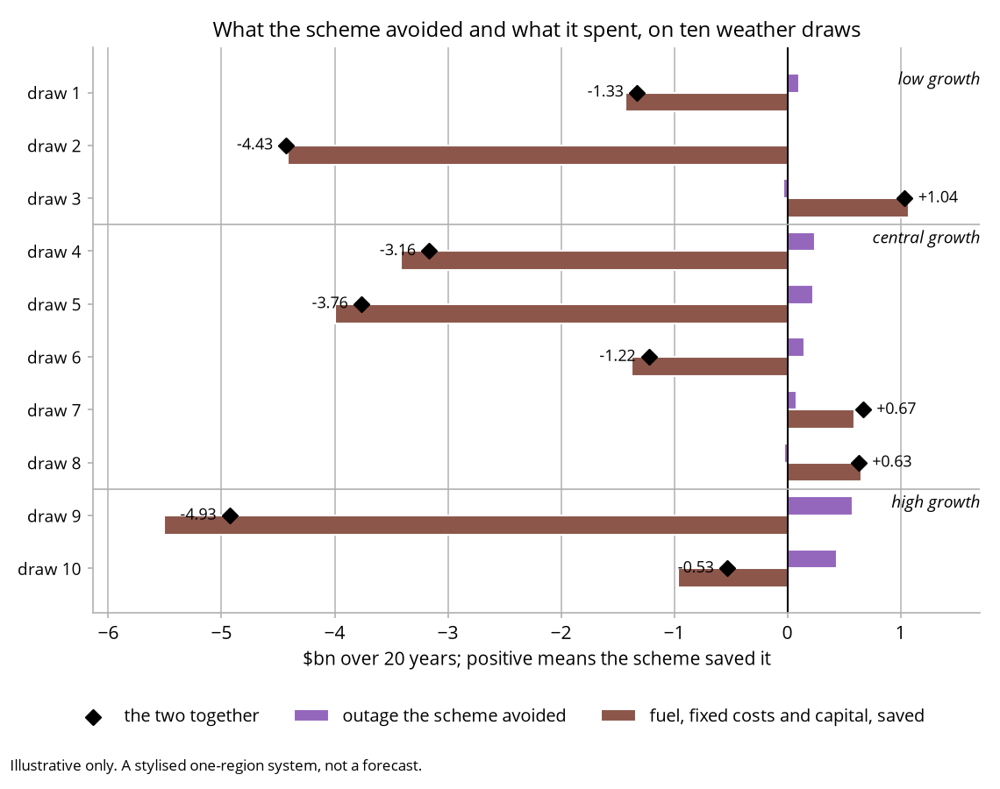
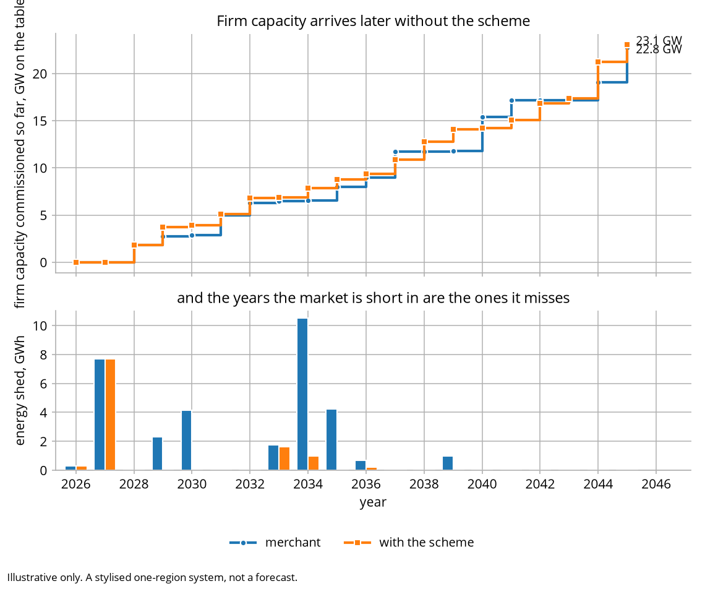

# Canonical outputs

Committed so a talk never depends on live compute, a working network or a
conference wifi connection. Regenerate with:

```bash
esem-sandbox run --out outputs/canonical
esem-sandbox compare --ticks 20 --seed 20260904 --out outputs/canonical \
  | tee outputs/canonical/comparison.txt
python tools/ten_seeds.py outputs/canonical/ten_seeds.csv 20
python tools/ten_seeds_figure.py      # the envelope as a picture, from the csv
python tools/arrival_figure.py        # when each leg's firm capacity arrives
```

`comparison.txt` is the second command's own output, so it has to be redirected.
Without the `tee` it is the one file here that does not update, and it goes stale
silently while everything around it changes.

`comparison.csv` and `comparison.txt` are one paired run: 20 years, one seed, both
legs on the same weather sequence. Read the two cost lines together. The scheme moves
the bill down by $8.26bn and the resource cost up by $0.53bn, and the $8.79bn
between them is a transfer from generators to consumers rather than a saving by
anybody. The two lines disagree in direction on this seed, which is why both are
printed and never one: the bill alone would call a scheme that consumed $0.53bn of
real resources an eight-billion-dollar saving.

Underneath the total, the scheme avoids $0.44bn of outage and spends $0.97bn more on
fuel, fixed costs and capital to do it. Whether that trade is worth taking is a
question about the value of lost load, which is a regulatory figure here and not a
measurement.

Read all of that as this draw's rather than the model's. `ten_seeds.csv` beside this
file is 10 seeds of the same comparison. The scheme improves reliability on seven of
the 10 and worsens it on three, and it lowers the total resource cost on three. The
outage it avoids runs from -$0.04bn to +$0.58bn, and what it spends on fuel, fixed
costs and capital runs from $5.51bn more than the market alone to $1.08bn less. Where
it avoids outage it usually spends more than the outage was worth, so the total goes
against it on six of those seven seeds; where it spends less, it has mostly bought
less reliability.

What travels is the sort, and it is monotone in growth. On the three low-growth draws
the scheme avoids almost no outage, -$0.04bn to $0.10bn, and buys 4,950 to 5,500 MW;
on the five central draws it avoids -$0.02bn to $0.25bn and buys 6,900 to 10,600 MW;
on the two high-growth draws it avoids $0.44bn and $0.58bn and buys 13,750 and
9,150 MW. It responds to the future it is in, and it responds to a future it only half
knows. This seed is a high-growth one, which is the flattering end of the range.

<picture>
  <source media="(prefers-color-scheme: dark)" srcset="ten_seeds_dark.png">
  
</picture>

`ten_seeds.png` is that table as a picture, one row per draw, slow growth at the
top and the largest outage avoided first within each band; the tool prints which
seed each row is. `arrival.png` is the canonical pair's firm capacity as it is commissioned,
year by year, over the energy each leg shed: the scheme leg's plant arrives in the
years the merchant leg is short in, and the merchant leg's arrives after them.

<picture>
  <source media="(prefers-color-scheme: dark)" srcset="arrival_dark.png">
  
</picture>

<picture>
  <source media="(prefers-color-scheme: dark)" srcset="dashboard_dark.png">
  
</picture>

`dashboard.png` is the same paired run as eight panels: the fleet at the end, the
reliability outcome against the standard, price duration, every build against the
test it passed, the two cost views with the transfer between them named, what the
lane asked for and got, what consumers paid, and what a cap cost.

The most useful rows are the first few, where both legs shed exactly the same energy:
on this seed 0.30 GWh in 2026 and 7.69 GWh in 2027, identical to the last decimal.
The plant awarded in 2026 has not been built yet. A procurement scheme is an
instrument about the future, and it cannot fix a year that arrives before its plant
does. Those rows coincide on both legs no matter which seed you run, and how much
they shed is the only part of that which changes.

Two caveats before quoting the cost lines.

Every figure here was produced under the default investment rule, in which each
investor prices its project against a forecast containing none of the others'
projects. The alternative rule, in which each is offered a market containing the one
before it, leaves the merchant leg nearly five times worse on unserved energy, and
the scheme goes from costing $1.88bn of resources to saving $8.24bn.
`tools/bracket_check.py` runs both ends. The reliability direction is the robust half
of this comparison; its size is not.

Every figure was also produced at an annual build ceiling of two concurrent projects
per technology. Doubling it removes the scheme's whole reliability effect on all four
seeds tested: the three where the scheme made reliability worse come level, and the
one where it helped most goes from a 28.5 GWh gain to none.
`tools/ceiling_sensitivity.py` runs it. The reliability comparison is
substantially a statement about that pacing parameter, and neither value is more
correct than the other.

`price_duration.png` and `worst_week.png` come from `esem-sandbox run`:

<picture>
  <source media="(prefers-color-scheme: dark)" srcset="price_duration_dark.png">
  
</picture>

<picture>
  <source media="(prefers-color-scheme: dark)" srcset="worst_week_dark.png">
  
</picture>

Everything here is illustrative. The system is stylised and none of it is a
forecast.
