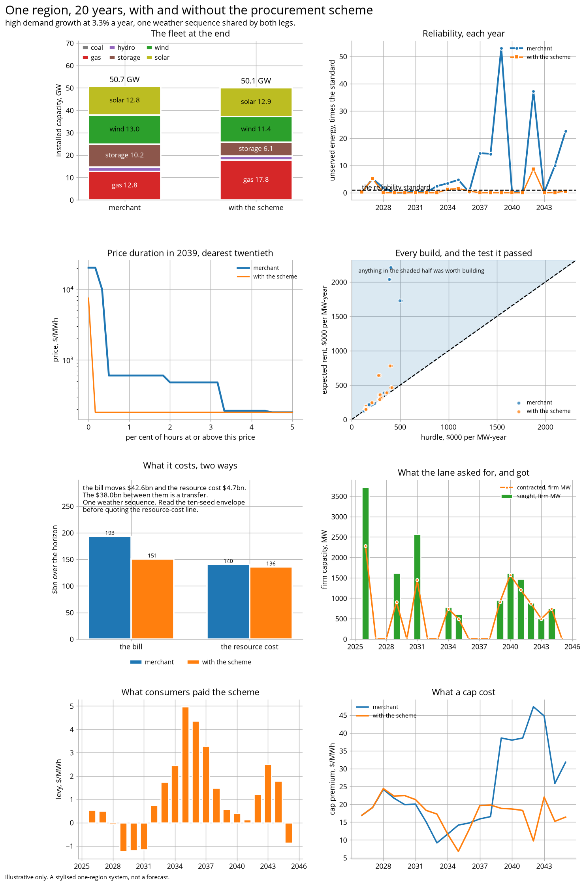
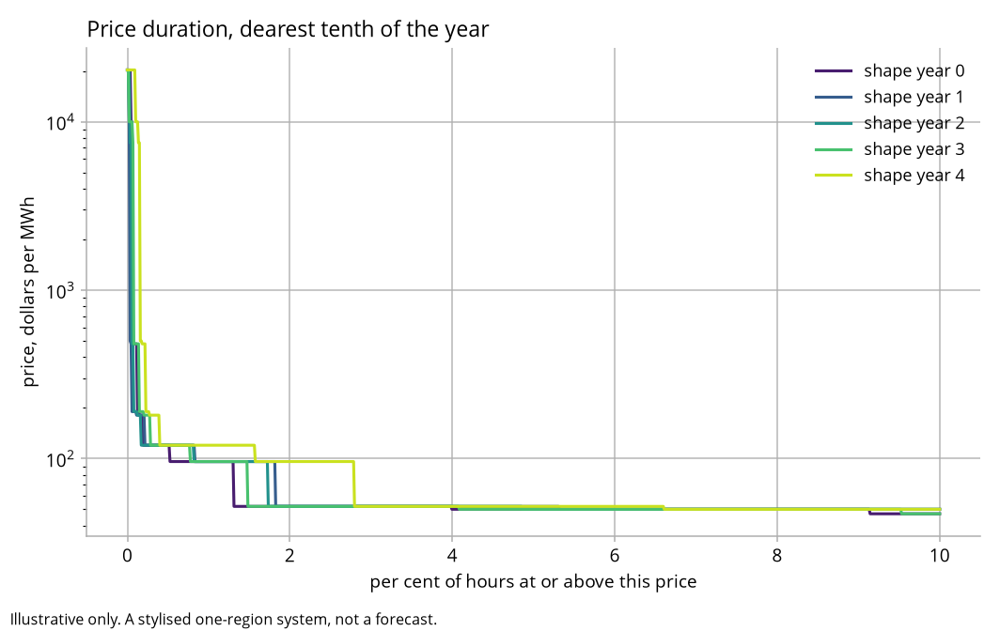
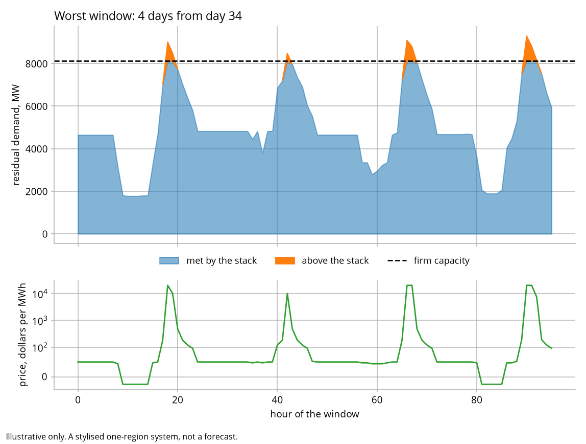

# Canonical outputs

Committed so a talk never depends on live compute, a working network or a
conference wifi connection. Regenerate with:

```bash
esem-sandbox run --out outputs/canonical
esem-sandbox compare --ticks 20 --seed 20260904 --out outputs/canonical \
  | tee outputs/canonical/comparison.txt
python tools/ten_seeds.py outputs/canonical/ten_seeds.csv 20
```

`comparison.txt` is the second command's own output, so it has to be redirected.
Without the `tee` it is the one file here that does not update, and it goes stale
silently while everything around it changes.

`comparison.csv` and `comparison.txt` are one paired run: 20 years, one seed, both
legs on the same weather sequence. Read the two cost lines together. The scheme moves
the bill down by $42.62bn and the resource cost down by $4.67bn, and the $37.96bn
between them is a transfer from generators to consumers rather than a saving by
anybody. The two lines agree in direction on this seed. They do not always, and the
bill overstates the case about nine times over, which is why both are printed and
never one.

Underneath the total, the scheme avoids $7.60bn of outage and spends $2.94bn more on
fuel, fixed costs and capital to do it. Whether that trade is worth taking is a
question about the value of lost load, which is a regulatory figure here and not a
measurement.

Read all of that as this draw's rather than the model's. `ten_seeds.csv` beside this
file is 10 seeds of the same comparison. The scheme improves reliability on all 10 and
lowers the total resource cost on one. The two halves of the resource-cost move are
each unanimous and point opposite ways: the outage avoided is positive on all 10, from
$0.05bn to $7.60bn, and fuel, fixed costs and capital are negative on all 10, from
$0.96bn to $6.68bn. Which is larger decides the total, and on nine of the 10 it is the
second.

What travels is the sort, and it is monotone in growth. On the three low-growth draws
the scheme avoids almost no outage, $0.05bn to $0.78bn, and buys 4,650 to 6,350 MW; on
the five central draws it avoids $0.72bn to $1.03bn and buys 8,750 to 15,100 MW; on the
two high-growth draws it avoids $0.61bn and $7.60bn and buys 10,750 and 17,550 MW. It
responds to the future it is in, and it responds to a future it only half knows. This
seed is a high-growth one, which is the flattering end of the range.

<picture>
  <source media="(prefers-color-scheme: dark)" srcset="dashboard_dark.png">
  
</picture>

`dashboard.png` is the same paired run as eight panels: the fleet at the end, the
reliability outcome against the standard, price duration, every build against the
test it passed, the two cost views with the transfer between them named, what the
lane asked for and got, what consumers paid, and what a cap cost.

The most useful rows are the first few, where both legs shed exactly the same energy:
on this seed 0.30 GWh in 2026 and 7.69 GWh in 2027, identical to the last decimal.
The plant awarded in 2026 has not been built yet. A procurement scheme is an
instrument about the future, and it cannot fix a year that arrives before its plant
does. Those rows coincide on both legs no matter which seed you run, and how much
they shed is the only part of that which changes.

Two caveats before quoting the cost lines.

Every figure here was produced under the default investment rule, in which each
investor prices its project against a forecast containing none of the others'
projects. The alternative rule, in which each is offered a market containing the one
before it, leaves the merchant leg five times worse on unserved energy, and the
scheme's net resource cost falls from $7.60bn to almost nothing.
`tools/bracket_check.py` runs both ends. The reliability direction is the robust half
of this comparison; its size is not.

Every figure was also produced at an annual build ceiling of two concurrent projects
per technology. Doubling it removes the scheme's whole reliability advantage on all
five seeds tested, including this one, where a 374.5 GWh gain becomes 0.7 GWh the
other way. `tools/ceiling_sensitivity.py` runs it. The reliability comparison is
substantially a statement about that pacing parameter, and neither value is more
correct than the other.

`price_duration.png` and `worst_week.png` come from `esem-sandbox run`:

<picture>
  <source media="(prefers-color-scheme: dark)" srcset="price_duration_dark.png">
  
</picture>

<picture>
  <source media="(prefers-color-scheme: dark)" srcset="worst_week_dark.png">
  
</picture>

Everything here is illustrative. The system is stylised and none of it is a
forecast.
